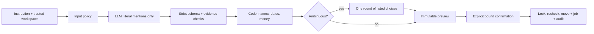

# Pipeline Copilot: design and tradeoffs

## 1. The authority boundary

The product translates one instruction into one bulk stage move. Python and SQLite
keep the action path inspectable; Pydantic supplies closed contracts and HTTPX
supplies cancellable I/O. No agent framework is used: tool selection, memory and
autonomous action loops would add authority the task does not need. The measured
Mistral 7.2B Q4_0 model was already available locally, supports schema-constrained
decoding, and permits genuine reproducible recordings without credentials. The
hosted adapter uses pinned `gpt-4.1-mini-2025-04-14`; its quality is not inferred from
the local model's results.

The LLM classifies an instruction and extracts quoted spans, not database IDs,
timestamps, SQL, tenant IDs or executable filters. Code owns all resolution,
arithmetic, selection, risk and writes. Crucially, no catalog names or opportunity
content enter the model context. The model request contains the instruction, a
fixed prompt and schema; repair adds application-controlled feedback. Repairs for
missing date comparators also include the prior schema-valid extraction, helping retain
the destination while restoring the comparison word. Other validation failures
re-extract from the instruction to avoid anchoring on invented/malformed values.
The complete replacement passes all validation again. User-authored
record text therefore cannot alter a model plan through retrieval or samples.

## 2. Constraining interpretation

Both providers receive the JSON schema. Independently, local validation forbids
extra keys, coercions, duplicate JSON keys, unknown fields and invalid ranges.
`Filter` is the bulk API's contract; a whitelisted compiler generates parameterized
SQL. A city/contact constraint cannot become a partial stage-only filter.

Every extracted field needs one distinct literal occurrence in the instruction,
including in an output labelled "clarify": a later answer must not bypass
validation. Source/target roles need their respective from/in/at and to/into
clauses; owners need ownership context. An owner named `Month` cannot consume
`month` in a separate date clause. Overlapping or repeated ambiguous evidence is
rejected. Time-like names in an ambiguous `for` clause need explicit ownership or
quotes. Explicit status adjectives cannot become stages. Date and money comparators must survive. Remaining
non-grammar terms trigger repair rather than silent omission. This added a useful
independent check: the original model confused **lost status** with **Closed Lost
stage**, executing a narrower, wrong selection in the baseline. A regression now
rejects that output before grounding. The original case and provider responses
remain in [the historical failure evidence](artifacts/historical-failures.json).

These checks are conservative evidence tests, not a proof of arbitrary English
equivalence. Legitimate unfamiliar constructions can fail. Unsupported requests
are refused; invalid model output gets at most one repair. The prompt never gets
gold labels. There is no unmeasured regex fallback after a provider failure.

## 3. Grounding and clarification policy

Names normalize Unicode, case, whitespace and punctuation. A unique complete name
is accepted. Otherwise a unique name/word prefix of **at least four characters**
is accepted; any collision asks, and no match refuses. There is no edit-distance
guessing or model confidence threshold. Thus `Priya Sharma` is exact, `Priya`
matches three owners, and `Proposal` matches two stages. Four characters avoid
promoting very short initials; uniqueness against the entire tenant catalog is
the main safeguard. A unique typo-prefix can still resolve incorrectly, and
catalog growth increases clarifications. Preview remains necessary.

All ambiguous slots are collected into one question set. The answer must specify
exactly the offered IDs. It is applied without another model call; expiry, tenant,
operation revision and catalog fingerprint are checked. A second conversation
round requires a new instruction. Unknown names/statuses never get invented.

Dates use an application-controlled clock. Interactive requests capture current
UTC once before inference; `--clock` supplies an explicit override. The operation
persists that instant, so model latency, a month rollover and later clarification
cannot change the intended range. Seed/demo/regression cases explicitly use
`2026-09-28T12:00:00Z`; challenge cases supply additional fixed clocks. UTC ranges
use inclusive lower and exclusive upper bounds. Last month/quarter are completed
calendar intervals; `today` and `yesterday` cover UTC calendar days. Rolling days
end at the captured clock. A duration of a month is 30 days. Quarter year
omission means the clock's year, disclosed in the preview. Missing timestamp field
asks; multiple fields refuse. Monetary arithmetic uses Decimal and integer paise;
unqualified values mean INR and disclose that assumption. Status and stage are
independent, including when moving to a closed stage.

Temporal words left outside extracted literal spans trigger bounded repair. This
closes the case where an omitted "last month" was treated as harmless grammar and
silently broadened the selection. Date checks apply before a clarification can
be issued, as well as before an immediate preview.

## 4. What a confirmation authorizes

Preview selection and persistence occur in one transaction. The saved plan includes
workspace, filter, target, interpretation clock and policy version. Its canonical
SHA-256 digest, full ordered matching-row fingerprint, catalog fingerprint, count,
value, operation revision and ten-minute expiry are stored. The preview includes
readable predicates, exact bounds, count, total and five samples. Only a random
256-bit capability's hash is persisted. Confirm accepts plan ID, capability and
plan hash; it accepts no replacement filter.

**Material change means any change to any matching row, membership, or workspace
catalog.** IDs and full row contents detect same-count/same-value replacements,
name edits, eligibility changes and version changes. This intentionally rejects
more than just financially material changes. Unrelated nonmatching opportunity
changes do not invalidate the plan. Other tenants' changes do not invalidate it.
An external writer that changes data and reverts it without advancing the version
can evade history detection; integration writers must maintain versions.

| Preview size, using all matching records | Action policy |
| --- | --- |
| At most 500 records and INR 10 million | Explicit confirmation |
| Above either soft limit, within hard limits | Separate two-minute challenge; type count, tenant and target |
| Above 5,000 records or INR 100 million | Narrow filter; no execution capability |

Hard-blocked/no-op previews fetch only samples after aggregate queries, bounding
Python memory. Executable previews fingerprint all matches. Confirmation takes
`BEGIN IMMEDIATE`, checks expiry/revision/integrity/catalog/full snapshot and risk,
then writes stages, versions, the job and audit together. A failure rolls back all
writes. SQLite permits only one writer, so no writer can slip between recheck and
update. Repeated/concurrent confirmation returns one unique job. Regeneration
invalidates old pending plans before awaiting the model. Second confirmation
rechecks the snapshot again. [SQLite transaction semantics](https://www.sqlite.org/lang_transaction.html).

## 5. Threat model and operational bounds

All queries carry the caller-selected tenant predicate. Entity and relationship
checks use composite `(workspace_id, id)` keys; foreign keys are enabled on each
connection. Plans, operations, challenges and jobs use the same scope. A capability
from Atlas cannot be used in Harbor even if a model emits foreign names. Record
and owner text is rendered as escaped data, including terminal and bidi controls.
Input attack-pattern checks reduce abuse but are not the tenant or authorization
boundary. [SQLite foreign keys](https://www.sqlite.org/foreignkeys.html).

There is deliberately no authentication. An attacker controlling the CLI process,
database or capability files is outside this boundary; the workspace selector is
not an identity system. A user can deliberately request a harmful but supported
move and explicitly confirm it. Ordinary semantic model errors remain possible.

The default budget is 25 seconds per attempt, two attempts and 52 seconds total,
400 generated tokens per call, and 2,000 input characters. `asyncio.wait_for`
enforces wall time, including a slow response body. Transient errors can retry;
non-retryable HTTP errors terminate. Failure creates no preview. Timeouts mark token
usage unknown rather than claiming the provider consumed zero. Provider timings
and usage are retained separately from replay timings. Request hashes cover
prompt/schema/settings/instruction/repair; a replay miss never triggers inference.

## 6. First scaling failure, and another week

At 100 instructions/second, this single local model first saturates and requests
hit their deadlines. Add admission control, tenant quotas and a bounded provider
pool before increasing traffic; benchmark a hosted small model against the same
corpus. Catalog growth to 200 overlapping owners and 40 stages does not increase
prompt size, but ambiguity and choice-list usability worsen. Introduce explicit
aliases with ownership and measurement, not fuzzy automatic matching.

At 20 million opportunities, aggregate scans and SQLite's single write lock become
the next bottleneck even though hard caps bound materialized rows. Move to Postgres,
tenant/selection indexes, query budgets and transactionally consistent membership
snapshots. A row-lock-only rewrite would miss newly matching rows; use a suitable
serializable transaction or an explicit writer coordination contract. Background
jobs cannot weaken preview binding and are intentionally outside this submission.

With another week, in order: (1) independently annotated, less templated held-out
language and adversarial counterexamples; (2) compare a second small model on cost,
false refusal and unsafe execution; (3) broaden supported phrasing with measured
evidence rules and calibrated aliases; (4) database contention/load tests and the
Postgres snapshot design; (5) better decision traces and CLI ergonomics. Authentication
belongs to a production integration, not an unrequested take-home expansion.
